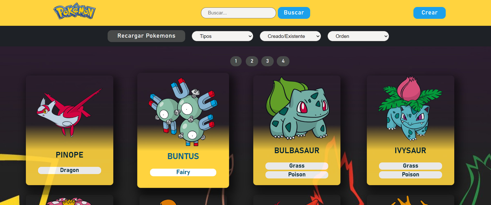
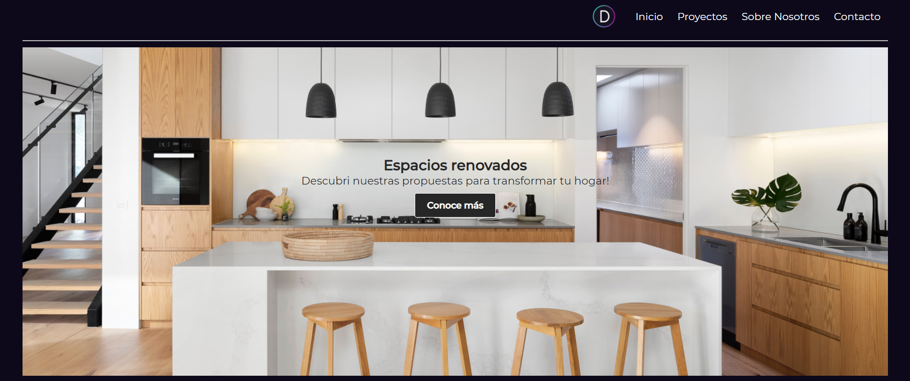

<!--
**ELIS7911/ELIS7911** is a ✨ _special_ ✨ repository because its `README.md` (this file) appears on your GitHub profile.

Here are some ideas to get you started:

- 🔭 I’m currently working on ...
- 🌱 I’m currently learning ...
- 👯 I’m looking to collaborate on ...
- 🤔 I’m looking for help with ...
- 💬 Ask me about ...
- 📫 How to reach me: ...
- 😄 Pronouns: ...
- ⚡ Fun fact: ...
-->
---

#### Hi there 👋 I'm FullStack Developer. I'm trained in JavaScript, HTML, CSS, Vue.Js, React, Redux, NodeJs, Express, PosgresSQL, Python y Django. I'm a person who takes on new challenges and works hard to overcome them. I'm strongly interested in developing my career in Front-End and Web-Design.

My experience has been mainly in design, since I am also an Architect and have worked for years as independent professional and university teacher. I am currently taking my last steps within Henry's Bootcamp, but I´m sure that they will be the first in this new path in which I will be able to deploy all the problem solving skills that I have been developing throughout this time.

If you are interested in knowing more, please contact me and I'll give you an answer as soon as possible.
#### 📬elianasciclone@gmail.com
#### https://www.linkedin.com/in/eliana-sciclone-b2b90010/

---

## :star: Languages and Tools:

- JavaScript
- HTML
- CSS
- React
- Redux
- Mongo
- PostgreSQL
- Sequelize
- Node
- Express
- Vue
- Python
- Django

## :pushpin: My proyects

## Pokemon App

#### Development of an SPA (Simple Page Application) implemented with the pokeAPI API. The page allows you to view Pokemons, filter them by type, sort them, search by name, access details and create new Pokemon through a controlled form, among other features.

#### The language I used to develop the whole project was JavaScript and the technologies implemented were:
#### Front-End: React, Redux and pure CSS
#### Back-End: NodeJs and Express
#### Database: PostgreSQL and Sequelize

## Decoplanners

#### Academic responsive site developed in HTML, CSS and JavaScript for Codo a Codo course. 

